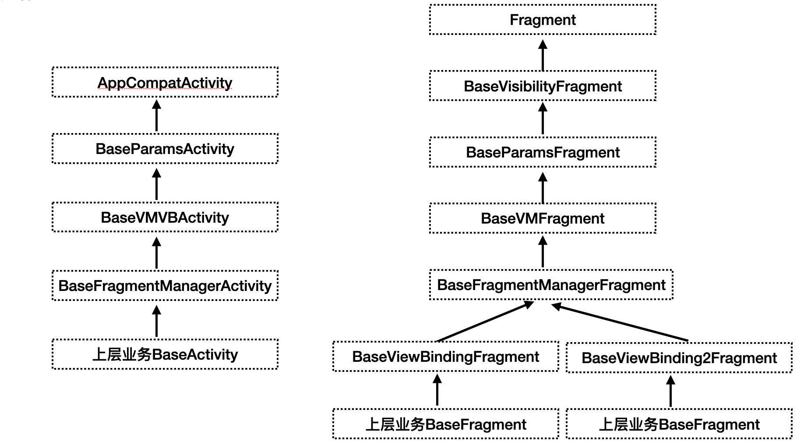

# 简介

从View的角色去看待Activity与Fragment，在使用场景上它们承担的职责基本一致即：接收数据>展示数据
所以本库中为这两者提供的API，保持高度的一致性，统一抽象为 init,与 bindData 两个方法。并提供对VB 与 VM的自动初始化
按照分层架构与数据驱动为架构核心封装的脚手架,可快速搭建出基于Google最新架构建议的项目框架。

核心功能：

* 1.明确View层在架构中的职责边界，规范初始化方法与简化生命周期
* 2.支持参数注解，自动初始化
* 3.ViewBinding 一行代码快速初始化（fragment 中自动跟随声命周期）
* 4.ViewModel 作用域管理、一行代码快速初始化
* 5.Fragment 可见状态简化管理
* 6.LiveData 支持无粘性消息
* 7.Fragment 快速切换（防重叠）

## 更新日志：

## 引用：

```kotlin
 implementation("com.foundation.app:activity-fragment:1.1.0")
```

类图：



# API

## 1.明确View层在架构中的职责边界，规范初始化方法与生命周期

* Base层对初始化方法的编排顺序

```kotlin
    override fun onCreate(savedInstanceState: Bundle?) {
        val support = supportRebuildData()//1
        val state = if (support) savedInstanceState else null
        beforeSuperOnCreate(state)//2
        super.onCreate(state)//3
        afterSuperOnCreate(state)//4
        getContentVB()?.let { setContentView(it.root) }//5
        initViewModel()//6
        init(state)//7
        bindData()//8
    }
```

* Fragment 初始化方法顺序
 
```kotlin
    override fun onCreate(savedInstanceState: Bundle?) {
        super.onCreate(savedInstanceState)
        initViewModel()//1
    }

    @CallSuper
    override fun onViewCreated(view: View, savedInstanceState: Bundle?) {
        super.onViewCreated(view, savedInstanceState)
        init(savedInstanceState)//2
        bindData()//3
    }
```

## 2.参数注解：BundleParams
是否兼容JAVA：是

### 2.1声明绑定

```kotlin
    @BundleParams("userName")
private String userName = "没自动赋值";

@BundleParams("userDesc")
private val userDesc: UserDesc = UserDesc()

@BundleParamsUseSerializable
@BundleParams("userDesc")
private val userDesc: UserDescSerializable = UserDescSerializable()
```

### 2.2手动使用：

```kotlin
ParamsUtils.initWithActivity()
ParamsUtils.initWithFragment()
```

### 2.3 单页面降级取消使用

```kotlin
openAutoBindParams(): Boolean = false
```

Tips:`onNewIntent`中不会进行重新绑定

## 3.ViewBinding 自动初始化

### 3.1  快速初始化 方式一
是否兼容JAVA：否

参考了默认fragment支持的自动根据布局id创建出根View，耦合性更低。
语意也更清晰，满足所见即所得。

```kotlin
class UserInfoActivity : BaseActivity() {
    private val vbBinding by lazyAndSetRoot<ActUserInfoBinding>()
}

class SkillListFragment : BaseViewBindingFragment(R.layout.act_vb) {

    val actVbBinding by lazyVB<ActVbBinding>()

    fun bindData() {
        actVbBinding.yourView
    }
}
```

### 3.2 快速初始化 方式二 （不建议）
是否兼容JAVA：是

完全使用反射初始化，耦合性较高，且无法脱离范型限制。

```kotlin
class UserInfoFragment : BaseFragment<ActVbBinding>() {

    fun bindData() {
       viewBinding.yourView
       //在java中使用
       jViewBinding.yourView
    }
}
```

### 3.3 Fragment 中ViewBinding的生命周期回调

```kotlin
fun onViewBindingDestroy()
``` 
此函数用于做一些跟view相关的释放工作。

Tips:如果在`onDestoryView`中访问 `XXbinding`将得到NPE,因为这是完全不被允许的，详情可参考google 文档建议

## 4.ViewModel 作用域管理、快速初始化

### 4.1 使用懒加载获取 （建议）
是否支持JAVA: 否

```kotlin
private val homeVM by lazyActivityVM<HomeVM>()
```
### 4.2 使用方法获取
是否支持JAVA: 是

```kotlin
    private lateinit var homeVM:HomeVM

    override fun initViewModel() {
        super.initViewModel()
        homeVM = getActivityVM(HomeVM::class.java)
    }
```

### 4.3 获取不同作用域的ViewModel的函数

* Activity 两个 

```kotlin
getActivityVM(clz: Class<VM>): VM

lazyActivityVM(): Lazy<VM>
```
```kotlin
getGlobalVM(clz: Class<VM>): VM

lazyGlobalVM(): Lazy<VM>
```
* Fragment 

```kotlin
getFragmentVM(clz: Class<VM>): VM

lazyFragmentVM(): Lazy<VM>
```

```kotlin
getActivityVM(clz: Class<VM>): VM

lazyActivityVM(): Lazy<VM>
```
```kotlin
getGlobalVM(clz: Class<VM>): VM

lazyGlobalVM(): Lazy<VM>
```

## 5.Fragment 可见状态完全控制
Tips：使用时对于可见状态完全依赖于底层框架的API，避免使用`onResume` ,`onPause`这两个生命周期，否则将得到不可预期的状态

可见时回调

```kotlin
    abstract fun onVisible(isFirst: Boolean)
```
不可见时回调

```kotlin
    abstract fun onHidden()
```

## 6.LiveData 支持无粘性消息

kotlin 中使用

```kotlin
yourLiveData.observerStickyLess(this) {}
```

java 中使用

```kotlin
 LiveDataExt.observerStickyLess(yourLiveData,this,it->{});
```

## 7.Fragment 快速切换（防重叠）

Activity 与 fragment中的API 相同

```kotlin
 fun switchFragment(
    @NonNull currentFragment: Fragment,
    @IdRes frameLayoutId: Int = 0,
    tag: String? = null
)

fun switchFragment(tag: String, @IdRes frameLayoutId: Int = 0): Fragment? 
```

Tips:默认关闭了Activity重建

```kotlin
     /**
 * 是否支持activity被杀死后重建（是否使用 savedInstanceState中相关数据，
 * 系统默认在其中保存了Fragment的状态，重建会导致fragment异常展示）
 *
 * @return 默认不支持。如果返回true，则必须测试杀死后重建的流程
 */
protected open fun supportRebuildData() = false
```